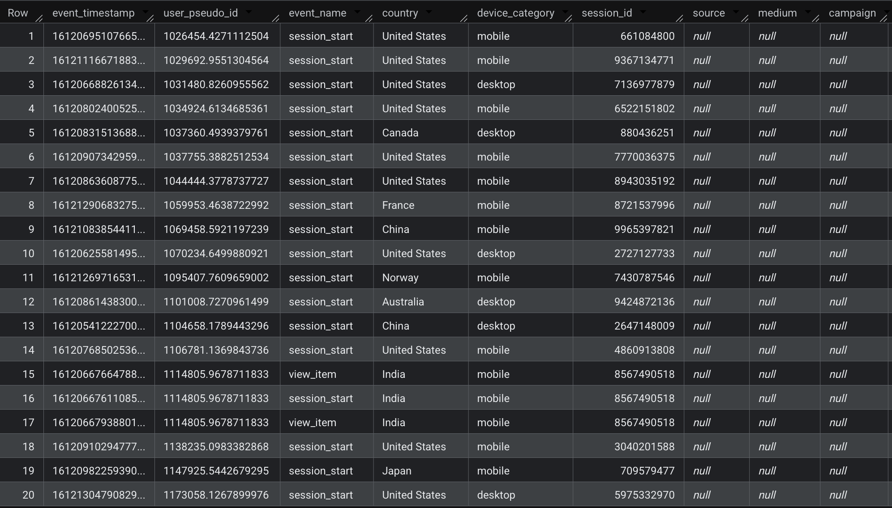
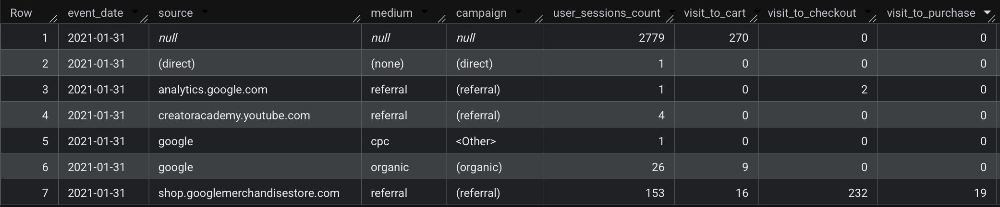

# GA4 E-commerce Funnel Analysis

## 📖 Project Overview

This project analyzes the Google Analytics 4 (GA4) Sample E-commerce dataset using Google BigQuery.

The objective is to explore user behavior throughout the customer journey by extracting event-level data, identifying traffic sources, and measuring conversion performance across the e-commerce funnel.

---

## 🎯 Business Objective

The analysis aims to answer the following business questions:

- Which traffic sources generate the most user sessions?
- How many users progress through each stage of the purchasing funnel?
- Which campaigns contribute most to conversions?
- Where do users drop off before completing a purchase?

---

## 🛠 Technologies


---

## 📂 Project Structure

```text
ga4-ecommerce-funnel-analysis/
│
├── README.md
├── images/
│   ├── extract_events_result.png
│   └── funnel_analysis_result.png
└── sql/
    ├── 01_extract_events.sql
    └── 02_funnel_analysis.sql
```

---

## 📊 Dataset

**Source**

```text
bigquery-public-data.ga4_obfuscated_sample_ecommerce
```

The dataset contains anonymized Google Analytics 4 event-level data, including user interactions, sessions, traffic acquisition information, and purchase events.

---

## 📄 SQL Files

### 01_extract_events.sql

Extracts event-level information including:

- Event Timestamp
- User ID
- Event Name
- Country
- Device Category
- Session ID
- Source
- Medium
- Campaign

---

### 02_funnel_analysis.sql

Builds an e-commerce conversion funnel by calculating:

- User Sessions
- Add to Cart
- Begin Checkout
- Purchases

Results are grouped by:

- Date
- Traffic Source
- Medium
- Campaign

---

## 📷 Query Results

### Event Extraction



This query extracts event-level GA4 data, allowing detailed analysis of user sessions, acquisition channels, devices, and geographic information.

---

### Funnel Analysis



This query aggregates GA4 events to evaluate conversion funnel performance across traffic sources and marketing campaigns.

---

## 💡 Key Insights

This project demonstrates how GA4 event-level data can be transformed into actionable business insights by:

- Tracking user journeys across the purchase funnel
- Measuring conversion performance
- Evaluating traffic acquisition quality
- Supporting marketing optimization through SQL analysis

---

## 🎯 Key Skills Demonstrated

- Google BigQuery
- Google Analytics 4 (GA4)
- SQL (Google Standard SQL)
- Event-Level Data Analysis
- Funnel Analysis
- Traffic Source Analysis
- Session Analysis
- Nested Data Extraction (`UNNEST`)
- Aggregate Functions
- Conversion Metrics
- Business Intelligence

---

## 👩‍💻 Author

**Gizem Kocaöz Acar**

Junior Data Analyst Portfolio
