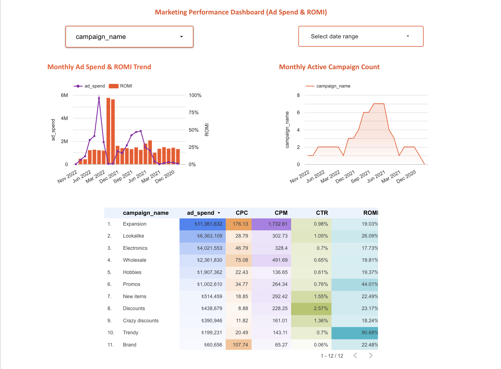

# Marketing Campaign Performance Analysis

## 📖 Project Overview

This project analyzes marketing campaign performance using Facebook Ads and Google Ads datasets.

The analysis focuses on advertising efficiency, campaign performance, UTM tracking, and monthly performance trends using SQL. Results are visualized through an interactive Looker Studio dashboard.

---

## 🛠️ Technologies


---

## 📂 Project Structure

```text
marketing-campaign-performance-analysis/
│
├── sql/
│   ├── 01_data_preparation.sql
│   ├── 02_campaign_metrics.sql
│   ├── 03_media_source_analysis.sql
│   ├── 04_campaign_adset_analysis.sql
│   ├── 05_top_campaign_analysis.sql
│   ├── 06_utm_campaign_analysis.sql
│   └── 07_monthly_performance.sql
│
├── dashboard/
│   ├── marketing_dashboard.png
│   └── README.md
│
├── dataset/
├── images/
└── README.md
```

---

## 📊 SQL Analysis

The project includes:

- Daily advertising performance analysis
- CPC, CPM, CTR and ROMI calculations
- Facebook Ads & Google Ads data integration
- Campaign and Ad Set performance analysis
- Top-performing campaign identification
- UTM Campaign performance analysis
- Monthly performance comparison using Window Functions (`LAG`)

---

## 📈 Dashboard

### Preview



### Interactive Dashboard

https://datastudio.google.com/reporting/06564fe0-c7f3-4165-a80c-fb1ce2cc771f

---

## 💼 Skills Demonstrated

- SQL Query Development
- Common Table Expressions (CTEs)
- JOIN Operations
- UNION ALL
- Aggregate Functions
- Window Functions (`LAG`)
- Marketing KPI Analysis
- Data Transformation
- Looker Studio Dashboard Development

---

## 📌 Key Business Metrics

- Ad Spend
- Impressions
- Clicks
- CPC (Cost per Click)
- CPM (Cost per Mille)
- CTR (Click Through Rate)
- ROMI (Return on Marketing Investment)

---

## 👩‍💻 Author

**Gizem Kocaöz Acar**

Junior Data Analyst Portfolio
