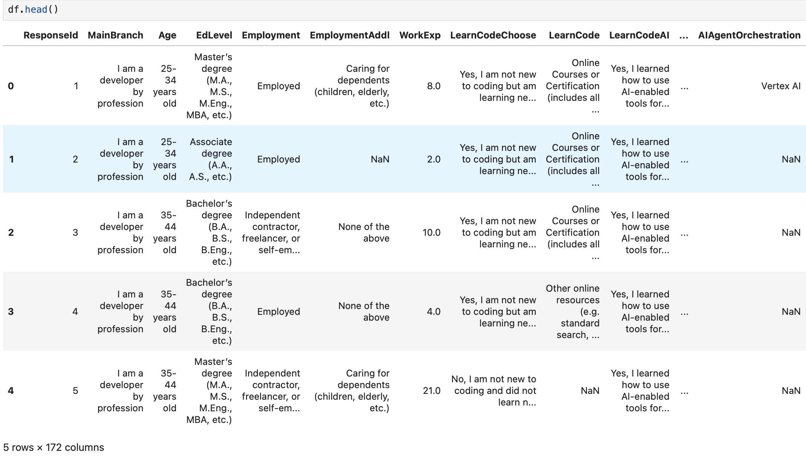
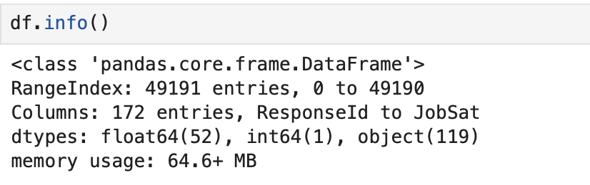
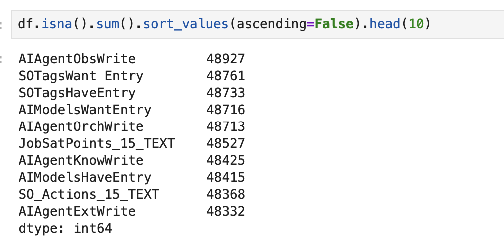
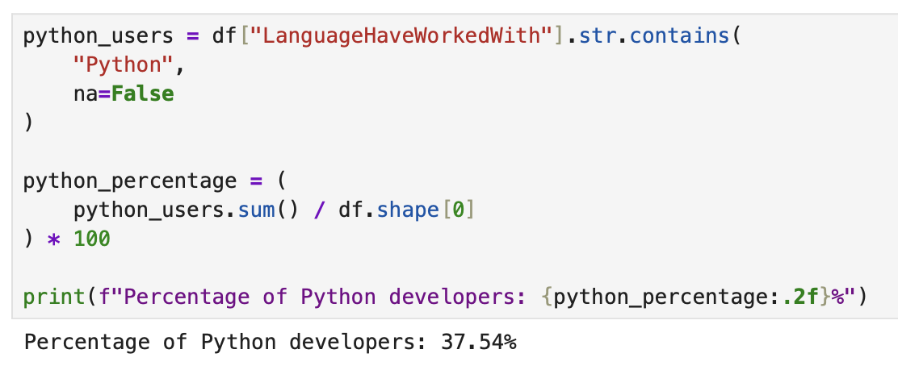
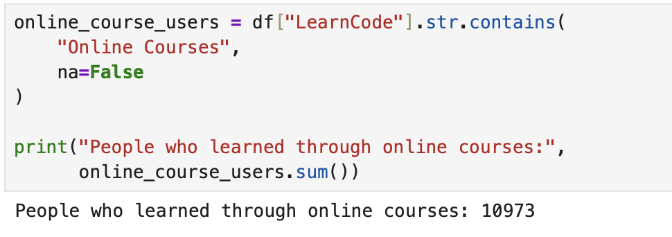
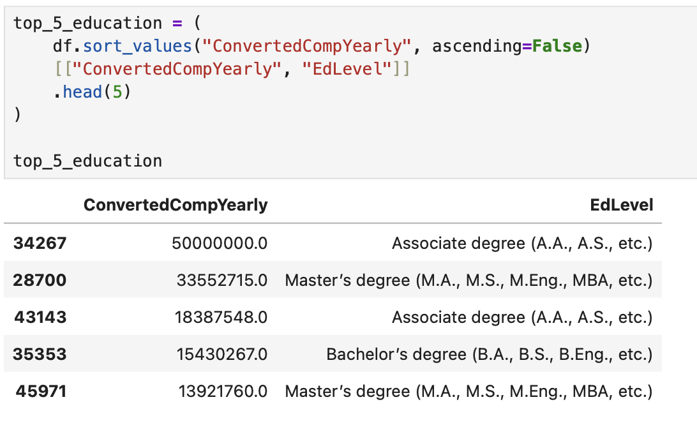

# Python Data Analysis & Visualization


## 📖 Project Overview

This project analyzes the Stack Overflow Developer Survey dataset using Python and Pandas.

The notebook demonstrates data exploration, data cleaning, descriptive statistics, filtering, and exploratory data analysis (EDA) on a real-world survey dataset.

---

## 🛠 Technologies

- Python
- Pandas
- Jupyter Notebook

---

## 📂 Repository Structure

```text
python-data-analysis-visualization/
│
├── README.md
├── notebook/
│   └── stackoverflow_survey_analysis.ipynb
├── dataset/
│   └── README.md
└── images/
    ├── dataframe_preview.png
    ├── dataframe_info.png
    ├── missing_values.png
    ├── python_usage_analysis.png
    ├── learning_resources_analysis.png
    └── education_analysis.png
```

---

## 📸 Dataset Preview



---

## 📸 Dataset Information



---

## 📸 Missing Value Analysis



---

## 📸 Python Usage Analysis



---

## 📸 Learning Resources Analysis



---

## 📸 Education Analysis



---

## 📓 Notebook

The complete analysis is available in:

```text
notebook/stackoverflow_survey_analysis.ipynb
```

---

## 📊 Dataset

The original dataset is not included in this repository because of GitHub file size limitations.

It can be downloaded from the official Stack Overflow Developer Survey repository.

---

## 💡 Skills Demonstrated

- Data Exploration
- Data Cleaning
- Exploratory Data Analysis (EDA)
- Descriptive Statistics
- Data Filtering
- Data Aggregation
- Pandas Data Manipulation

👩‍💻 Author

Gizem Kocaöz Acar

Junior Data Analyst Portfolio
