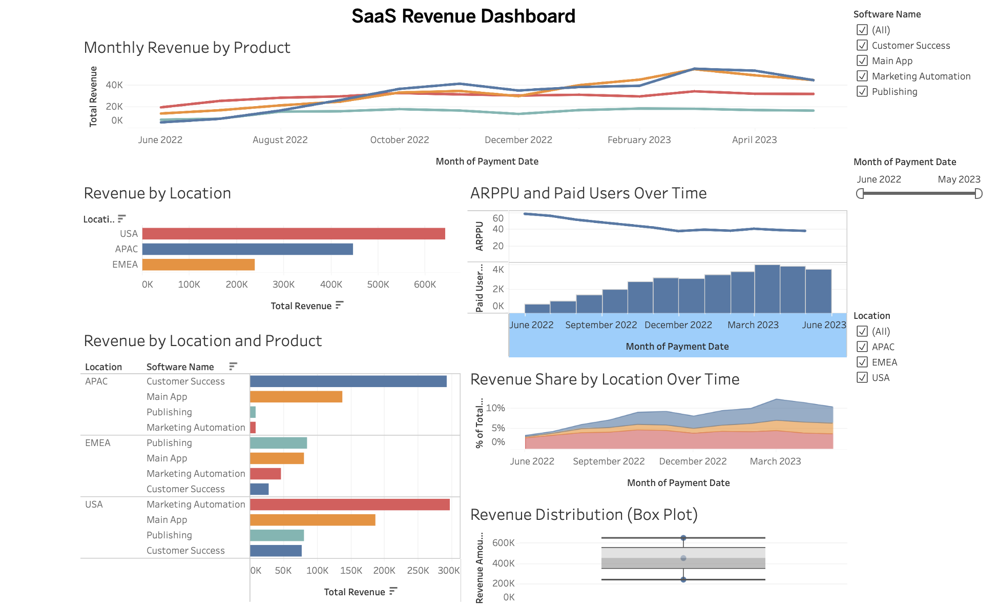
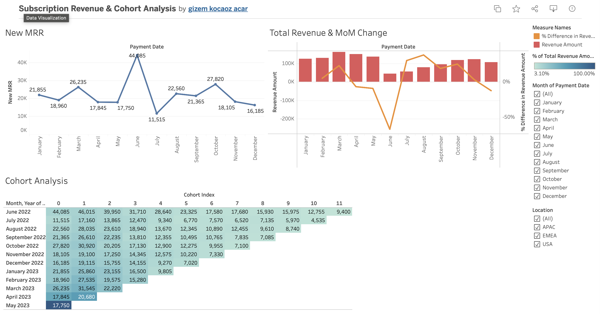

# SaaS Revenue & Cohort Analysis Dashboard

## 📖 Project Overview

This project analyzes subscription-based SaaS revenue using Tableau. It provides interactive dashboards to monitor Monthly Recurring Revenue (MRR), revenue trends, customer cohorts, ARPPU, and subscription performance across products and regions.

The dashboards help identify revenue growth patterns, customer retention, and business performance through interactive visual analytics.

---

## 🎯 Business Objective

The analysis aims to answer the following business questions:

- How does Monthly Recurring Revenue (MRR) change over time?
- How is total revenue distributed across products and locations?
- Which regions generate the highest revenue?
- How does customer revenue evolve across cohorts?
- What is the Month-over-Month (MoM) revenue change?
- How do ARPPU and paid users change over time?

---

## 🛠 Technologies


---

## 📂 Project Structure

```text
saas-revenue-cohort-analysis-dashboard/
│
├── README.md
├── dashboard/
│   ├── dashboard_1.png
│   └── dashboard_2.png
├── workbook/
│   └── SaaS_Revenue_Cohort_Analysis.twbx
```

---

## 📊 Dataset

This project uses a SaaS subscription dataset containing payment history, subscription products, customer regions, and recurring revenue information.

The dataset supports business analysis of:

- Monthly Recurring Revenue (MRR)
- Total Revenue
- ARPPU (Average Revenue Per Paying User)
- Paid Users
- Revenue by Product
- Revenue by Region
- Customer Cohort Performance

---

## 📈 Dashboard Preview

### Executive Revenue Dashboard



This dashboard provides an executive overview of SaaS business performance, including:

- Monthly Revenue by Product
- Revenue by Location
- Revenue by Product and Location
- ARPPU and Paid Users Over Time
- Revenue Share by Location
- Revenue Distribution (Box Plot)

---

### MRR & Cohort Analysis Dashboard



This dashboard focuses on subscription growth and customer retention through:

- New Monthly Recurring Revenue (MRR)
- Total Revenue
- Month-over-Month Revenue Change
- Cohort Analysis Heatmap

---

## 🌐 Live Dashboards

### Executive Revenue Dashboard

https://public.tableau.com/app/profile/gizem.kocaoz.acar/viz/SubscriptionRevenueCohortAnalysis_17771256224160/ExecutiveRevenueDashboard?publish=yes

### MRR & Cohort Analysis Dashboard

https://public.tableau.com/app/profile/gizem.kocaoz.acar/viz/SubscriptionRevenueCohortAnalysis_17771256224160/MRRCohortAnalysisDashboard?publish=yes

---

## 💡 Key Insights

This dashboard enables business stakeholders to:

- Monitor Monthly Recurring Revenue (MRR) trends.
- Evaluate subscription revenue across products and regions.
- Identify high-performing markets and software products.
- Analyze customer retention using cohort analysis.
- Track Month-over-Month (MoM) revenue growth.
- Monitor ARPPU and paid user trends to support business decisions.

---

## 🎯 Key Skills Demonstrated

- Tableau Dashboard Development
- Data Visualization
- Business Intelligence
- SaaS Analytics
- Subscription Revenue Analysis
- Monthly Recurring Revenue (MRR)
- Cohort Analysis
- Customer Retention Analysis
- ARPPU Analysis
- Month-over-Month (MoM) Analysis
- Calculated Fields
- LOD Expressions
- Table Calculations
- Interactive Dashboard Design
- Data Storytelling

---

## 📁 Workbook

The complete Tableau workbook is included in this repository:

```text
workbook/SaaS_Revenue_Cohort_Analysis.twbx
```

---

## 👩‍💻 Author

**Gizem Kocaöz Acar**

Junior Data Analyst Portfolio
