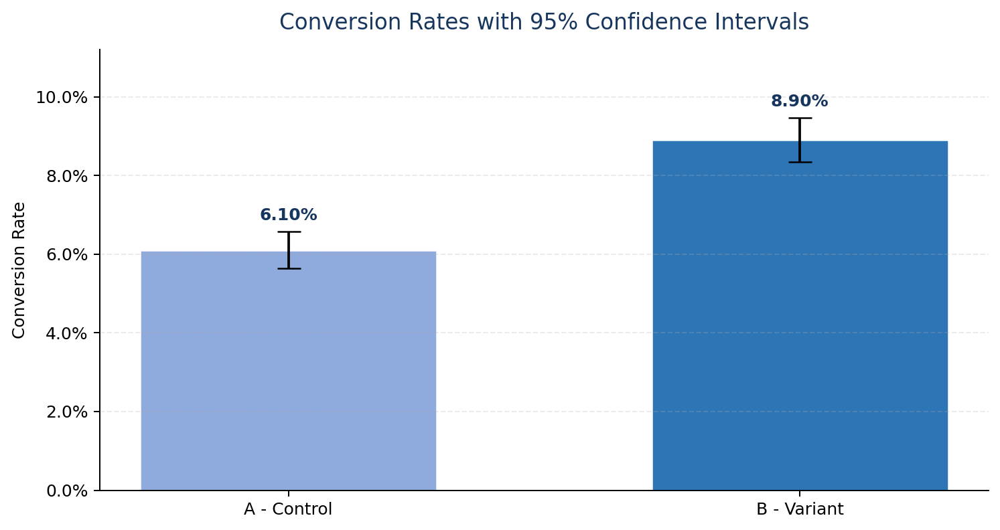
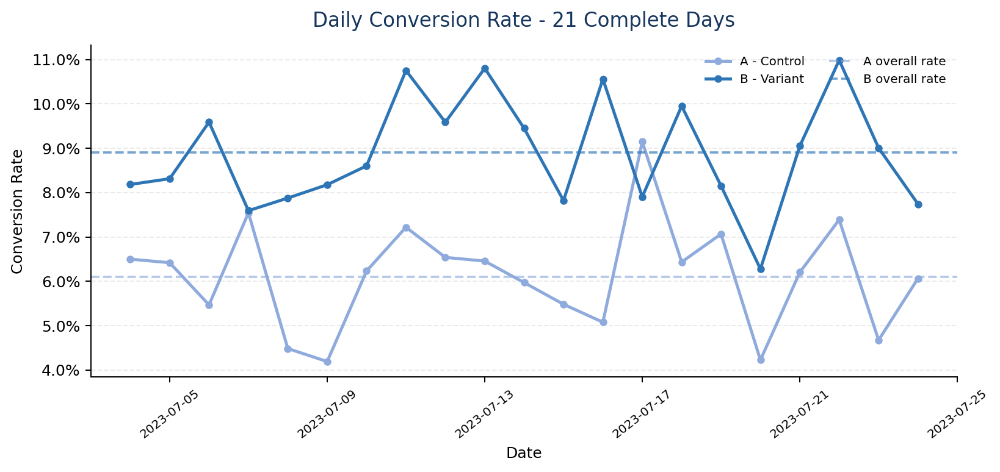

# Subscription Paywall A/B Test Analysis


## Project Overview

This project evaluates whether presenting a **$4.99 weekly premium subscription as a “50% discount”** improves purchase conversion compared with the standard subscription screen.

The analysis covers the full experimentation workflow: data validation, test-period review, conversion analysis, statistical hypothesis testing, confidence intervals, effect-size measurement, time-trend analysis, and a business recommendation.

### Test Groups

- **Group A — Control:** Standard $4.99 subscription offer
- **Group B — Variant:** The same $4.99 offer presented as a 50% discounted offer

### Business Question

Does the discount-framed paywall generate a statistically and commercially meaningful increase in subscription conversion?

## Technologies

- Python
- Pandas
- SciPy / Statsmodels methodology
- Matplotlib
- Jupyter Notebook
- Two-proportion z-test
- Confidence interval analysis

## Project Structure

```text
subscription-paywall-ab-test-analysis/
├── README.md
├── ab_test_data.csv
├── ab_test_conversion_analysis.ipynb
├── conversion_rates_ci.png
├── daily_conversion_trend.png
└── subscription_paywall_ab_test_report.pdf
```

## Analysis

### Dataset Validation

- **19,998** unique users
- No missing values
- No duplicated user IDs
- Test period: **July 3–25, 2023**
- Test duration: **23 calendar days**

### Conversion Results

| Group | Users | Conversions | Conversion Rate | 95% Confidence Interval |
|---|---:|---:|---:|---:|
| A — Control | 10,013 | 611 | 6.10% | 5.63%–6.57% |
| B — Variant | 9,985 | 889 | 8.90% | 8.34%–9.46% |

### Effect Size

- **Absolute lift:** +2.80 percentage points
- **Relative lift:** +45.91%
- The observed lift exceeded the predefined **+2 percentage-point minimum detectable effect**.

### Statistical Test

A **one-sided two-proportion z-test** was used because the predefined alternative hypothesis expected the variant to outperform the control.

- **H₀:** The conversion rate of Group B is not higher than Group A.
- **H₁:** The conversion rate of Group B is higher than Group A.
- **Z-statistic:** 7.52
- **P-value:** 2.75 × 10⁻¹⁴
- **Decision:** Reject H₀ at α = 0.05.

The variant produced a statistically significant increase in conversion.

## Visualizations

### Conversion Rates with 95% Confidence Intervals



### Daily Conversion Trend



The time-trend visualization includes only the **21 complete calendar days** from July 4 to July 24. Partial boundary days were excluded from this chart to avoid misleading volatility, while all 19,998 users remained included in the primary hypothesis test.

## Business Recommendation

The B variant should be rolled out gradually. It increased conversion from **6.10% to 8.90%**, delivering both a statistically significant result and a commercially meaningful improvement.

During rollout, the product team should continue monitoring conversion and add guardrail metrics such as refund/cancellation rate, revenue per paywall view, retention, and support complaints in a real production environment.

## Skills Demonstrated

- A/B test design and evaluation
- Data validation and aggregation with Pandas
- Conversion-rate and lift calculation
- Statistical hypothesis testing
- Confidence interval estimation
- Time-series visualization
- Data-quality assessment
- Translating statistical results into a product decision

## Author

**Gizem Kocaöz Acar**  
[GitHub Portfolio](https://github.com/gizemkocaoz/data-analytics-portfolio)

