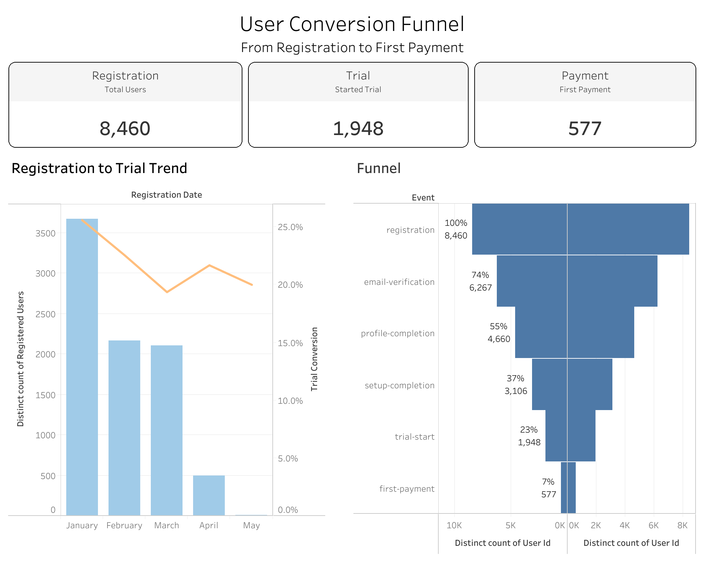

# User Funnel Conversion Analysis

## Overview

This project analyzes the user journey from registration to first payment using an interactive Tableau dashboard. It highlights conversion rates, user drop-offs, and monthly registration-to-trial trends.

## Business Problem

Understanding where users leave the onboarding journey is essential for improving activation and paid conversion. This analysis identifies the stages with the greatest user loss and provides a clear view of the overall funnel performance.

## Funnel Stages

- Registration
- Email Verification
- Profile Completion
- Setup Completion
- Trial Start
- First Payment

## Key Metrics

- **Registered Users:** 8,460
- **Email Verification:** 6,267 users — 74%
- **Profile Completion:** 4,660 users — 55%
- **Setup Completion:** 3,106 users — 37%
- **Trial Start:** 1,948 users — 23%
- **First Payment:** 577 users — 7%

## Key Insights

- The largest overall decline occurs between registration and trial start.
- Only 23% of registered users begin a trial.
- 577 users complete their first payment, resulting in a 7% registration-to-payment conversion rate.
- The funnel helps identify onboarding stages that may require optimization.
- Monthly registration and trial conversion trends make changes in user behavior easier to monitor.

## Dashboard Preview

## Tools & Technologies

- Tableau
- Data Visualization
- Funnel Analysis
- Conversion Rate Analysis
- KPI Development

## Live Dashboard

[View the interactive dashboard on Tableau Public](https://public.tableau.com/app/profile/gizem.kocaoz.acar/viz/User_Funnel_Conversion_Analysis/Dashboard1)

## Skills Demonstrated

- Building an end-to-end conversion funnel
- Creating KPI cards
- Calculating stage-level conversion rates
- Identifying user drop-off points
- Visualizing monthly performance trends
- Designing an interactive business dashboard

## Author

**Gizem Kocaöz Acar**  
Junior Data Analyst  
[GitHub Portfolio](https://github.com/gizemkocaoz/data-analytics-portfolio)
